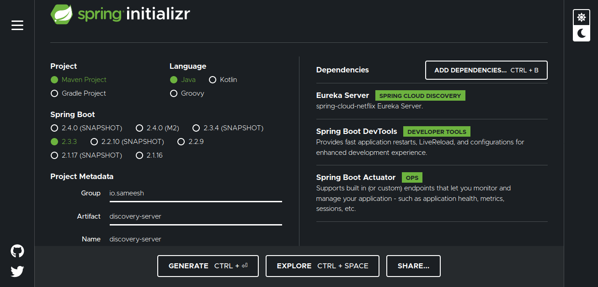
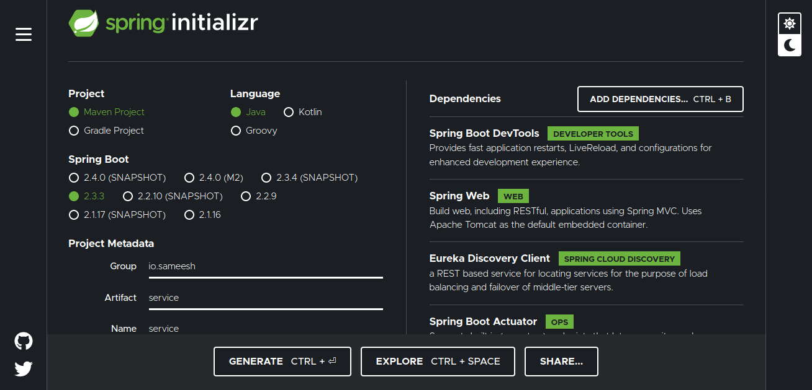
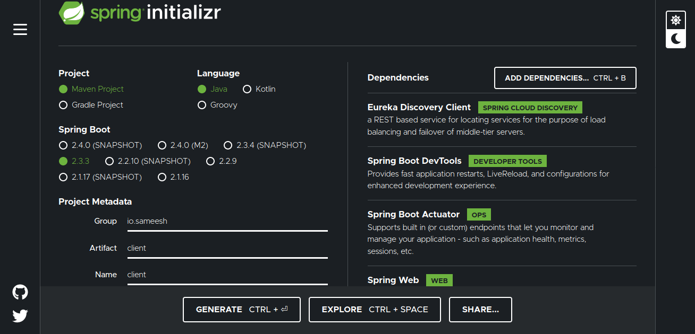

# spring-cloud-ecosystem

This is small cluster of small projects consistes of

1. discovery server
2. Application service
3. Client application...

## Discovery Server

spring boot application generated using spring intilizer

## Application Service

Provides some application functionality, the receiver of requests. one or more instances might be present.

## Client service

This application will act as user of application service.

## Parts of Full fledged microservice architecture  
1. Config Management  
2. Service Discovery & Load Balancing  
3. Resilience and Fault Tolerance  
4. API Management  
5. Service Security  
6. Centralized Logging  
7. Centralized Metrices   
8. Distributed Tracing  
9. Scheduling and Deployment  
10. Auto Scaling and Self Healing  

We can achive most of the things using Kubernetes and spring cloud in this project we are sampling with spring cloud.  

