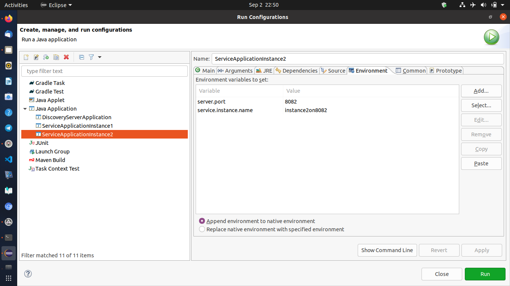

# Service Application

- Provides some application functionality
- The receiver of requests
- A dependency of other services
- One or more instances
- User of the discovery client  
   register
  deregister

## steps needed to convert spring boot application to service application with discovery depedency

1. add below entry in the application.property  
   `eureka.client.service-url.defautlZone=http://localhost:8761/eureka`
   this is for looking up the discovery server.
2. In main class add one annotation `@EnableDiscoveryClient`, this will register our application service with discovery server.
3. Also save the run configuration to run services parrellely for local testing
   
